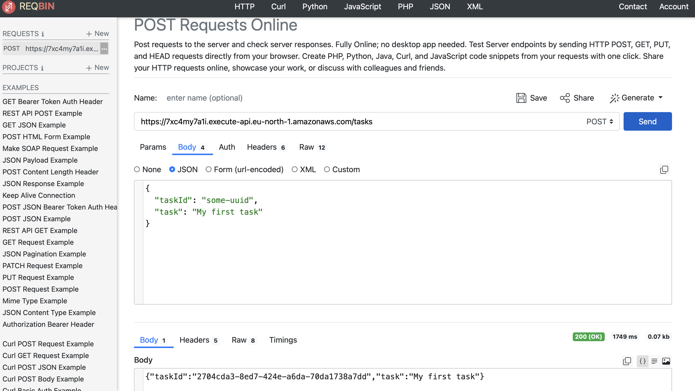
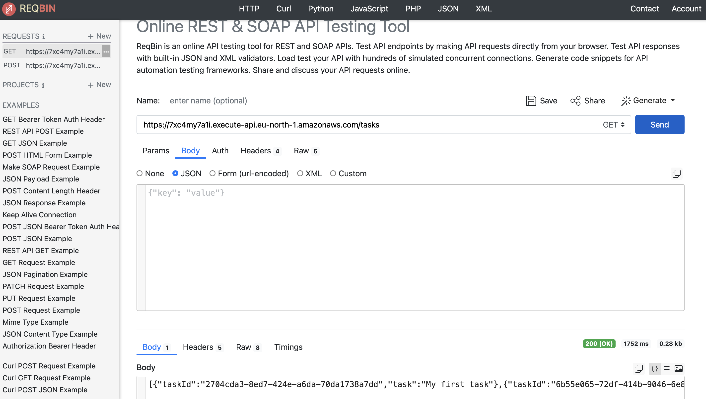
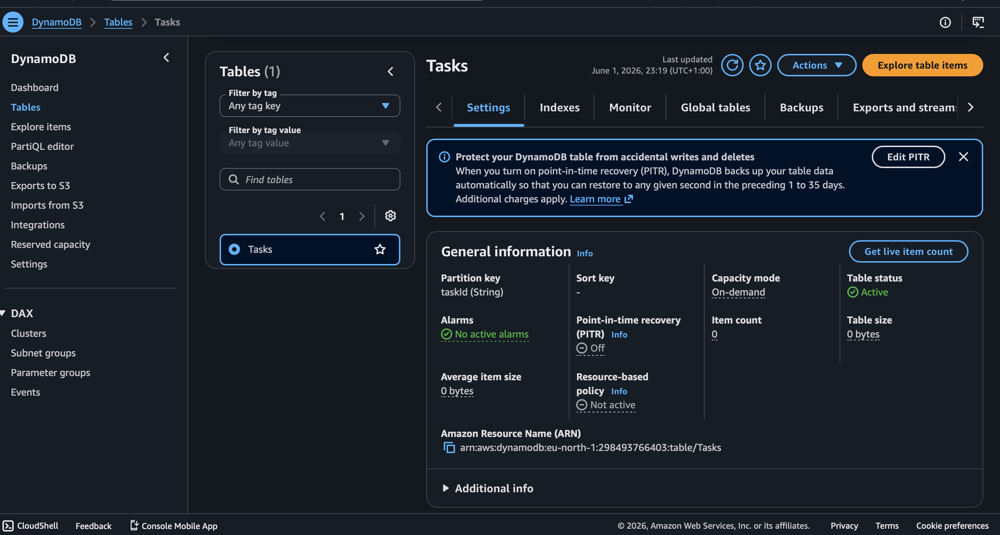
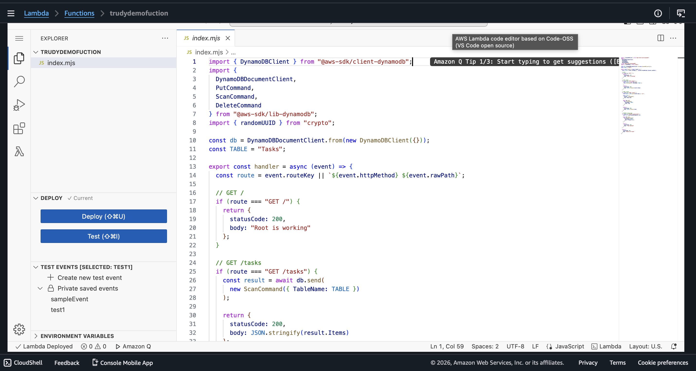
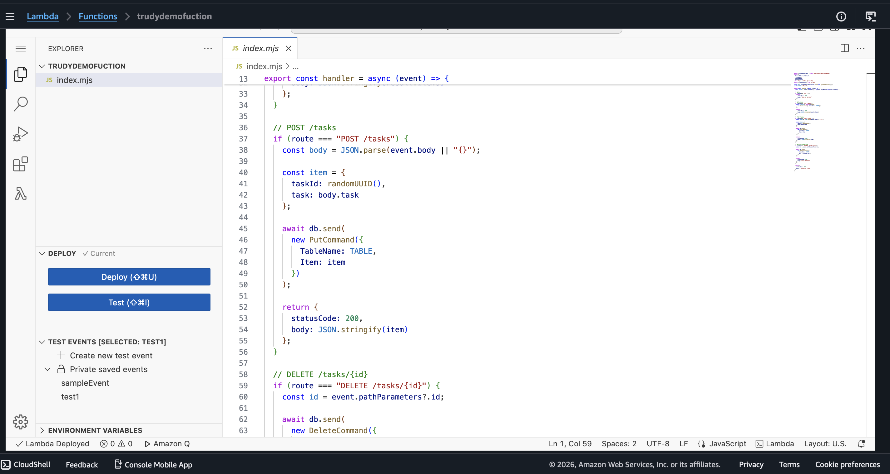
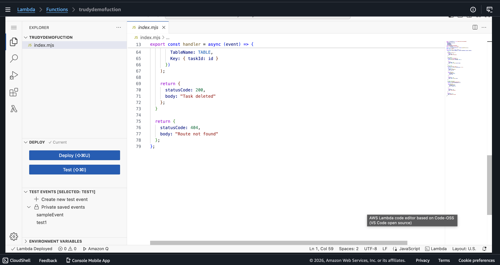
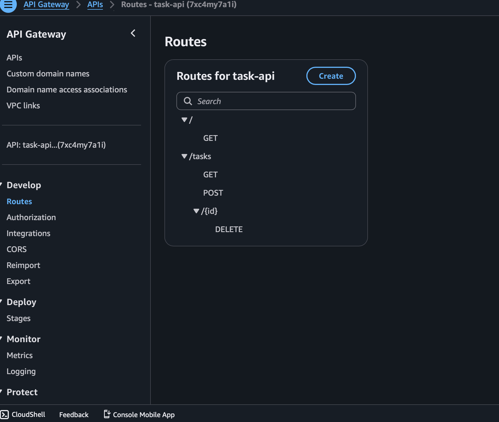

# aws-serverless-task-api
serverless Task API using AWS Lambda, API Gateway, and DynamoDB
# Serverless Task Management API (AWS)

# Overview
This project is a serverless CRUD API built using AWS services. It allows users to create, read, and delete tasks.

# Architecture
- API Gateway → Handles HTTP requests
- AWS Lambda → Runs backend logic
- DynamoDB → Stores tasks

# API Endpoints
- POST /tasks → Create a task
- GET /tasks → Get all tasks
- DELETE /tasks/{id} → Delete a task

# Testing Evidence

## POST Request

---

## GET Request

---

## DynamoDB Table

---

## Lambda Function

---

## API Gateway Routes

 # Result
The API successfully stores and retrieves data using AWS serverless architecture.

 What I Learned
- How to use AWS Lambda
- How API Gateway connects to Lambda
- How DynamoDB stores data
- How to build a serverless backend
